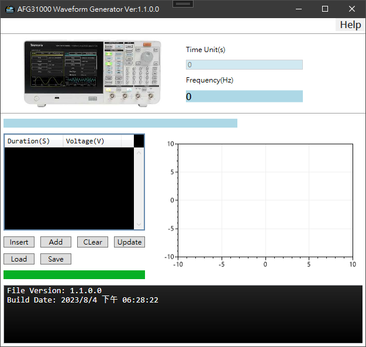

# Tektronix AFG31000 Waveform Converter

Convert a csv file into AFG31000 csv format


## Input File format

***Decimal or Scientific notation***:arrow_forward: Can be Mixed types

### Decimal

```c
// Time(Seconds), Voltage(V)
0.0005, 5
0.0005, 0
0.0004, 4
0.0006, 0
0.0006, 3
0.0004, 0
0.0003, 3
0.0007, 0
```

### Scientific notation

```c
// Time(Seconds), Voltage(V)
5e-4, 5
5e-4, 0
4e-4, 4
6e-4, 0
6e-4, 3
4e-4, 0
3e-4, 3
7e-4, 0
```

## Output Format

```c
// Time(Seconds), Voltage(V)
1.000000E-004,5.000
2.000000E-004,5.000
3.000000E-004,5.000
4.000000E-004,5.000
5.000000E-004,5.000
6.000000E-004,0.000
7.000000E-004,0.000
8.000000E-004,0.000
9.000000E-004,0.000
1.000000E-003,0.000
1.100000E-003,4.000
1.200000E-003,4.000
1.300000E-003,4.000
1.400000E-003,4.000
1.500000E-003,4.000
1.600000E-003,4.000
1.700000E-003,4.000
1.800000E-003,4.000
1.900000E-003,4.000
2.000000E-003,4.000
2.100000E-003,3.000
2.200000E-003,3.000
2.300000E-003,3.000
2.400000E-003,3.000
2.500000E-003,3.000
2.600000E-003,3.000
2.700000E-003,3.000
2.800000E-003,3.000
2.900000E-003,3.000
3.000000E-003,3.000
```
